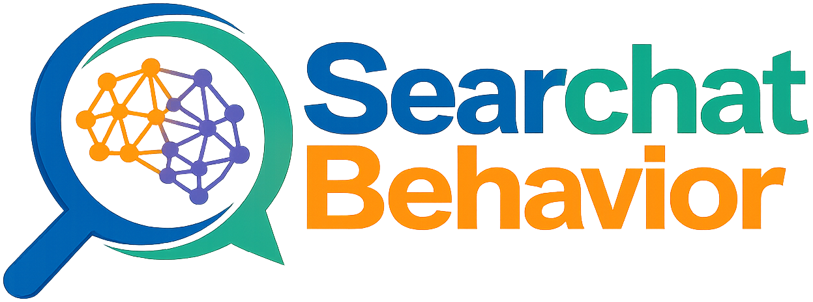

<p align="center">
  
</p>
<p align="center">
A standardized framework for capturing authentic human behavior in search and AI-chat experiments.
</p>
<p align="center">
  
  <a href="./LICENSE"></a>
  
</p>

## 📖 Description

This repository contains the frontend application for **Searchat Behavior**. It provides the user interface for participants and researchers to interact with search-based and chat-based experimental tasks.

Built with **React**, this application communicates with the backend API to manage experiment flows, authentication, task rendering, and data submission.

> **⚠️ Note:** If you want to run the full stack (Frontend + Backend +
> Database) together, please refer to the [Searchat Behavior Parent
> Repository](https://github.com/Framework-for-Search-as-Learning/searchat-behavior).
> The instructions below are strictly for running the frontend
> **independently** for isolated development or testing.

---

## 🛠️ Prerequisites

The required tools depend on how you plan to run the application:

### 🐳 Option A: Running with Docker (Recommended for quick start)

You only need:

- **Docker** and **Docker Compose**

### 💻 Option B: Running Locally

If you want to run the NestJS application directly on your machine, you
need:

- **Node.js** (v18+ recommended)
- **pnpm** (Or any equivalent package magager such as `npm` or `yarn`)

---

## 1️⃣ Clone the Repository

```bash
git clone https://github.com/Framework-for-Search-as-Learning/searchat-behavior-ui.git
cd searchat-behavior-ui
```

---

## 2️⃣ Run the Application

### 🐳 Method A: Docker


```bash
docker compose up --build
```

### 💻 Method B: Local Development

1.  Install dependencies:

```bash
pnpm install
```

2.  Start development server:

```bash
pnpm start
```
---

## 3️⃣ Accessing the Application

- Frontend: http://localhost:3001/
> **⚠️ Note:** Make sure the backend API is running and accessible.

---

## 5️⃣ Stopping the Application

```bash
docker compose down
```

---

## 📄 License

Released under the [MIT license](./LICENSE).
